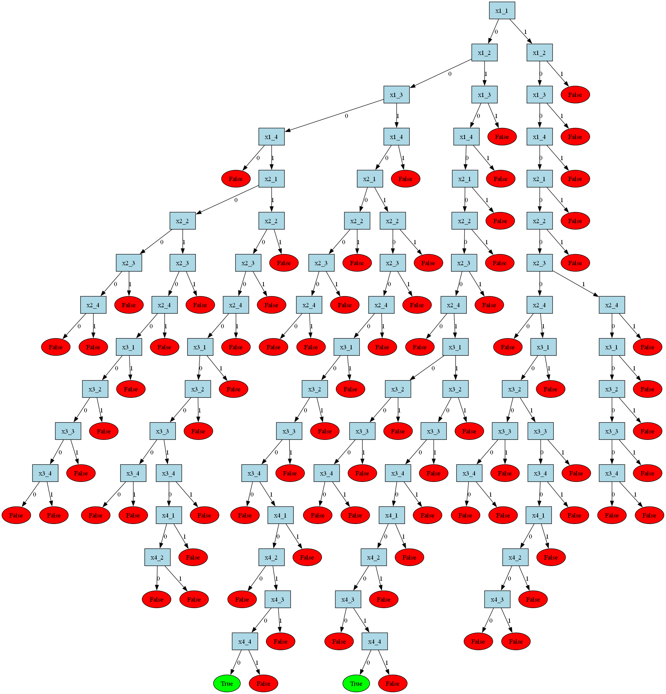

# bdd-queens
Решение задачи N ферзей с использованием бинарных диаграмм решений (BDD) на языке Haskell

### Как запускать
В корне проекта выполнить:

```bash
cabal build
cabal run
```
После запуска в консоли надо будет ввести размеры поля и в конце будет выведена команда для получения изображения.

Пример команды:
```bash
dot -Tpng nqueens.dot -o queens_4x4.png 
```
Здесь имя выходного файла (queens_4x4.png) будет меняться в зависимости от размера поля — например, для поля 5x5 это может быть queens_5x5.png

### Решение на поле 4 на 4


